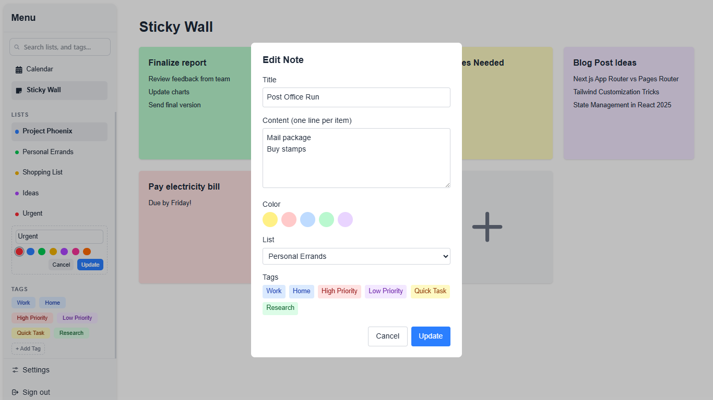
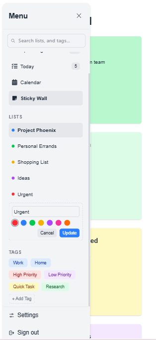
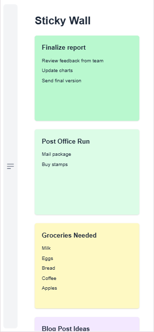
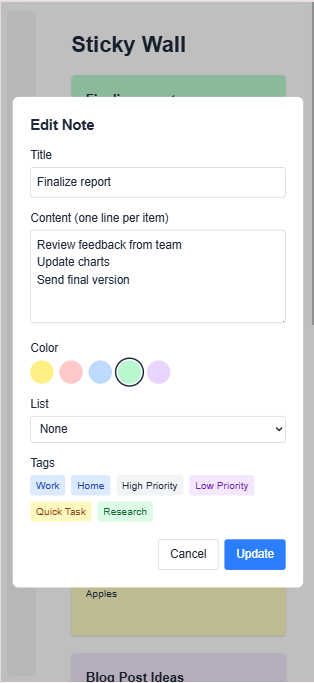

# 📝 Sticky Wall - Task Management App  

https://anashannani.github.io/sticky-wall/

Sticky Wall is a task management application built with React.js and Tailwind CSS. It allows users to create, manage, and organize tasks as interactive sticky notes.

## 🚀 Features  

- 🟢 **Create, Read, Update, Delete (CRUD)** operations for tasks  
- 🎨 **Customizable note colors** for better organization  
- 📂 **Task categories** to organize tasks into lists  
- 🔍 **Search functionality** to quickly find tasks  
- 🏷️ **Tag system** to categorize tasks (e.g., "Urgent", "Work", "Personal")  
- 💾 **LocalStorage persistence** to save tasks between sessions  
- 📱 **Responsive design** for a seamless experience across devices  

## 🛠️ Tech Stack  

- **Frontend:** React 19, Tailwind CSS  
- **State Management:** React Context
- **Build Tool:** Vite  
- **Icons:** React Icons  

## 📂 Project Structure  
```sh
sticky-wall/ 
        ├── dist/                       # Build output directory (automatically generated by Vite)
        ├── public/                     # Static assets copied directly to dist root (e.g., favicon.ico, robots.txt)
        │   ├── Desktop.png             
        │   ├── Mobile_1.png           
        │   ├── Mobile_2.png         
        │   ├── Mobile_3.png         
        ├── src/                        # Main application source code
        │   ├── assets/                 # Static assets processed by the build tool (images, fonts, global CSS)
        │   │   └── index.css           # Global stylesheets, resets, base styles
        │   ├── components/             # Reusable React components used across the application
        │   │   ├── ui/                 # Basic, generic UI building blocks (often stateless, presentational)
        │   │   │   ├── ErrorMessage.jsx # Component to display error messages uniformly
        │   │   │   ├── IconButton.jsx  # A button component focused on displaying an icon
        │   │   │   ├── Icons.jsx       # Exports various SVG icons as React components (or a similar icon system)
        │   │   │   └── SectionHeader.jsx # Reusable header for distinct content sections
        │   │   ├── layout/             # Components defining the overall page structure and layout
        │   │   │   ├── Header.jsx      # Top application header/navigation bar
        │   │   │   └── SidePanel.jsx   # The main SidePanel structural component and logic container
        │   │   ├── common/             # More complex reusable components, potentially with state or specific logic
        │   │   │   └── SearchBar.jsx   # Reusable search input component with its logic
        │   │   ├── notes/              # Components specifically related to the 'Notes' feature
        │   │   │   ├── ButtonAddNote.jsx # Button dedicated to triggering the 'add note' action
        │   │   │   ├── ContentHeader.jsx # Header section within the main notes content area
        │   │   │   ├── NoteActions.jsx # Component holding actions for a note (edit, delete, etc.)
        │   │   │   ├── NoteCard.jsx    # Component displaying a single note preview/summary
        │   │   │   ├── NoteGrid.jsx    # Component responsible for laying out NoteCards in a grid
        │   │   │   ├── NoteModal.jsx   # Modal dialog for creating or editing a note
        │   │   │   └── NoteTags.jsx    # Component to display/manage tags associated with a note
        │   │   ├── sidepanel_sections/ # Components representing specific sections within the SidePanel feature
        │   │   │   ├── Lists.jsx       # Component for displaying categorized lists in the SidePanel
        │   │   │   ├── Tags.jsx        # Component for displaying and filtering by tags in the SidePanel
        │   │   │   └── Tasks.jsx       # Component for displaying tasks or similar items in the SidePanel
        │   │   └── MainContent.jsx     # Container component for the main content area (likely holds NoteGrid, ContentHeader)
        │   ├── context/                # React Context API for global/shared state management
        │   │   └── DataContext.jsx     # Provides application data (notes, tags, user info, etc.) via context
        │   ├── hooks/                  # Custom reusable React hooks (e.g., useFetch, useLocalStorage, useDebounce)
        │   ├── pages/                  # Top-level route components, representing distinct application screens/views
        │   │   └── Home.jsx            # The main page/view of the application (renders layout, main content, etc.)
        │   ├── services/               # (OPTIONAL) Functions for interacting with external APIs or backend services
        │   ├── styles/                 # (OPTIONAL) More complex styling organization (e.g., CSS Modules, themes, base styles)
        │   ├── types/                  # (OPTIONAL - Recommended if using TypeScript) TypeScript type definitions and interfaces
        │   ├── utils/                  # Utility functions (non-React specific helpers: formatting, validation, etc.)
        │   │   └── noteUtils.js        # Utility functions specific to note data manipulation (consider .js if no JSX/hooks inside)
        │   └── main.jsx                # Application entry point: Renders the root component, sets up routing, providers, etc.
        ├── .gitignore                  # Specifies intentionally untracked files that Git should ignore (e.g., node_modules, dist, .env)
        ├── README.md                   # Project overview, setup instructions, contribution guidelines, etc.
        ├── eslint.config.js            # Configuration for ESLint (JavaScript/JSX linter)
        ├── index.html                  # Main HTML template file used by Vite during development and build
        ├── package-lock.json           # Records the exact versions of dependencies installed (ensures reproducible builds)
        ├── package.json                # Project metadata, dependencies, scripts (build, dev, test, lint)
        └── vite.config.js              # Configuration file for the Vite build tool
```

## 📦 Installation & Running  

1️⃣ Clone the repository:  
```sh
git clone https://github.com/AnasHannani/sticky-wall.git
cd sticky-wall
```
2️⃣ Install dependencies:
```sh
npm install
```
3️⃣ Start the development server:
```sh
npm run dev
```
4️⃣ Open http://localhost:5173 in your browser.

📝 Future Improvements
- 🏗️ Drag-and-drop functionality to rearrange notes
- ☁️ API integration for cloud storage
- 📅 Due dates and reminders for tasks

## 📸 Screenshots

<details>
<summary>Click to view Application Screenshots</summary>

### Desktop View

*Main application interface on desktop*

---

### Mobile Views
     
*Side panel navigation on mobile*       

         
*Main notes grid on mobile* 

        
*Editing or creating a note on mobile*

</details>
